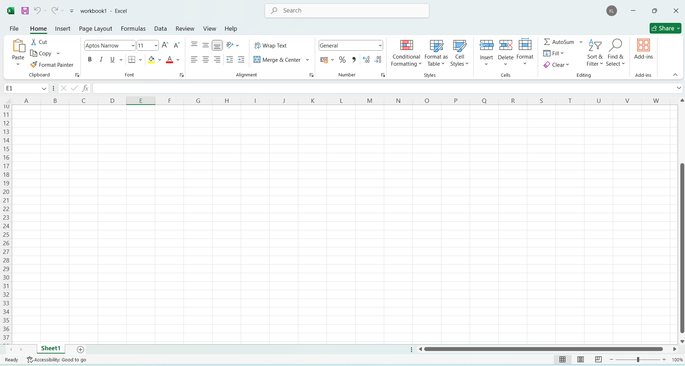

# What is excel in DA ? 

   1. excel is an application software 
   2. excel basically create  workbook 
      examples : workbook1.xlsx

      **screenshot**

      

   3. excel create multiple sheet inside of any worksheet

      examples : create a multiple sheet or worksheet

      

   4. rows an workbook1.xlsx 

       rows(1,2,3,4,5) verticle data 

   5. columns an workbook1.xlsx 

      columns(A,B,C,D) horizontal data display          
     
      
   
   6. cell : cell is intersection of rows and columns
           
          examples : cell(A1:A5)

          

    7. basic formula in excels is calculated by with "="

    8. Function in excel : inbuilt function provided in excel such as 

       examples : sum() , avg() , min() , max(), index(), vlookup() , textlookup(), match() etc 

    9. Range : A group of adjacent cells for examples : cell(A1:B5)
                                                        cell(A2:B5)

# basic interface related in excel

   **structures o basic interface**

   

   1. ribbon : The toolbar of excel located at top with tabs such as Home | insert | page layout | formulas | data | Reviews | View | Help

   2. Name Box: shows the active cell references
          examples : A1 | B1 | C1 | D1 

             
   3. formula BAR : displays or edits the active cell formula or value

         examples : "="

           

   4. status BAR : shows information like sum , average , count of selected cell 

      examples :  

        
        

   5. sheet tabs : switch between worksheet at the bottom of excel

            
    

             
# common features of excel 

# common shortcut of excel

         