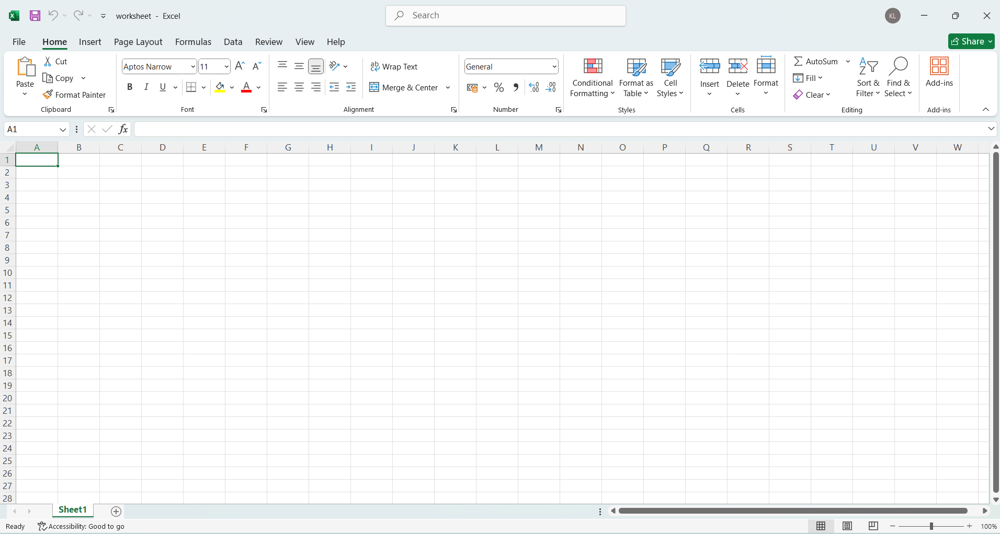
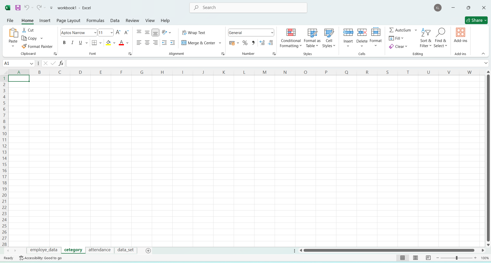
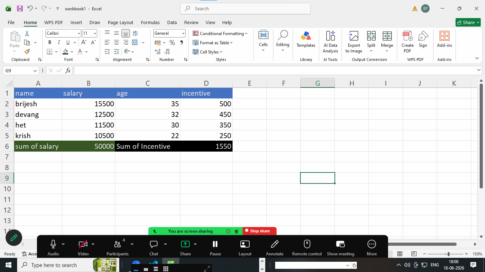
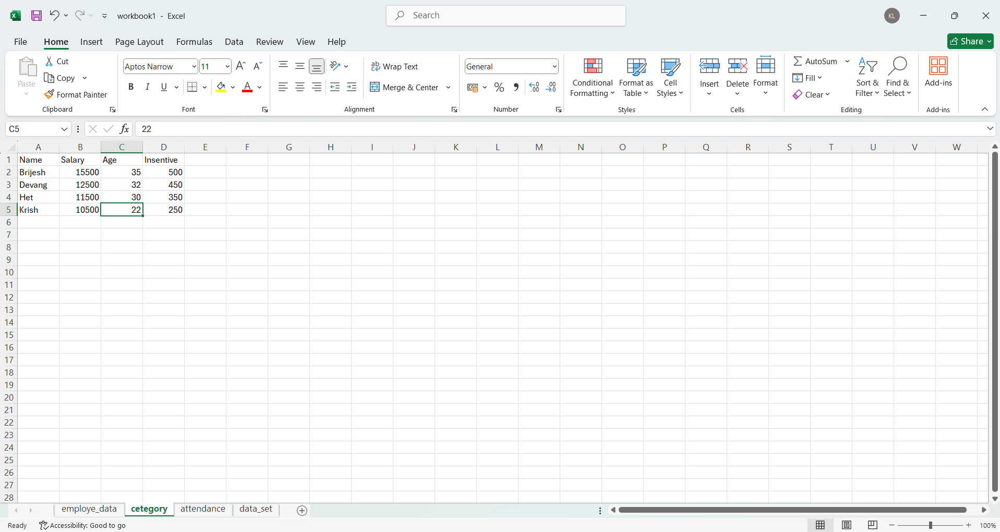
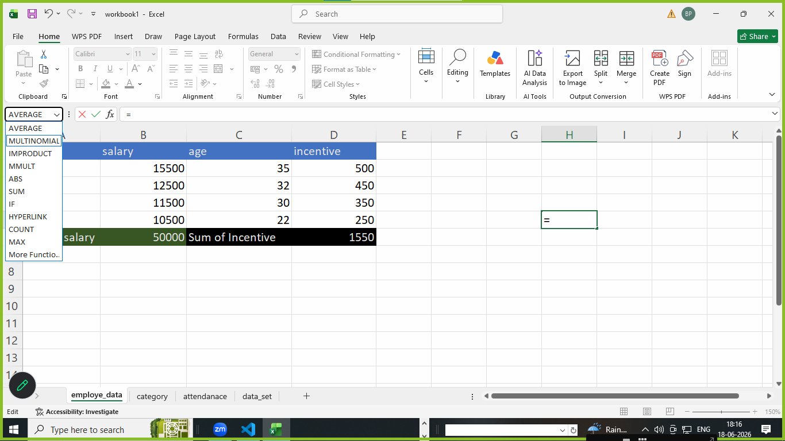
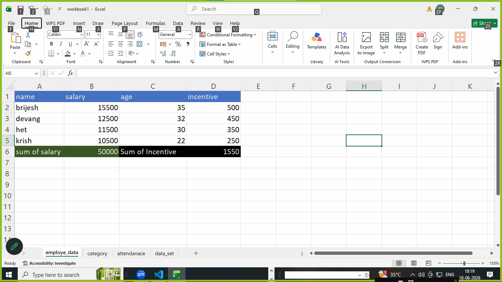

# What is excel in DA ? 

   1. excel is an application software 
   2. excel basically create  workbook 
      examples : workbook1.xlsx

      **screenshot**

      

   3. excel create multiple sheet inside of any worksheet

      examples : create a multiple sheet or worksheet

      

   4. rows an workbook1.xlsx 

       rows(1,2,3,4,5) verticle data 

   5. columns an workbook1.xlsx 

      columns(A,B,C,D) horizontal data display          
     
      
   
   6. cell : cell is intersection of rows and columns
           
          examples : cell(A1:A5)

    7. basic formula in excels is calculated by with "="

    8. Function in excel : inbuilt function provided in excel such as 

       examples : sum() , avg() , min() , max(), index(), vlookup() , textlookup(), match() etc 

    9. Range : A group of adjacent cells for examples : cell(A1:B5)
                                                        cell(A2:B5)

# basic interface related in excel

   **structures o basic interface**

   

   1. ribbon : The toolbar of excel located at top with tabs such as Home | insert | page layout | formulas | data | Reviews | View | Help

   2. Name Box: shows the active cell references
          examples : A1 | B1 | C1 | D1 

             
   3. formula BAR : displays or edits the active cell formula or value

         examples : "="

         

   4. status BAR : shows information like sum , average , count of selected cell 

      examples :  

      
        

   5. sheet tabs : switch between worksheet at the bottom of excel

       
    

             
# common features of excel 

# common shortcut of excel

# what is pivot tables ?
 
 1. A pivot table is one of the most powerfull features in excel
 2. pivot is allow yoy to summerise, analize, organize, and calculate large amount of data without writting complex formulas.
 

## wht we called it pivot in excel ?

 1. The word pivot means rotate or turn arround 
 2. In excel you can rotate rows into columns into rows and rearrange daata without changing the origing the original dataset

## Advantage of using pivot in excel ? 

 1. Analyze thousands of rows in seconds 
 2. Find totals sales on thousands or lakhes of data
 3. Clculate average salray
 4. compatred data department wise
 5. Generate reports 
 6. Create dashboard
 7. Analyse profites
 8. Summerize expences
 9. Group dates (month, quarter, yearly)

## Featuers of pivot in Excels ?

 1. No formula required to calculate 
 2. Drag and Drop interface
 3. Automatic calculations
 4. dynamic repoorts generate
 5. Easy filtering
 6. Shorting
 7. Grouping
 8. Data Refresh
 9. multiple calculation 

         